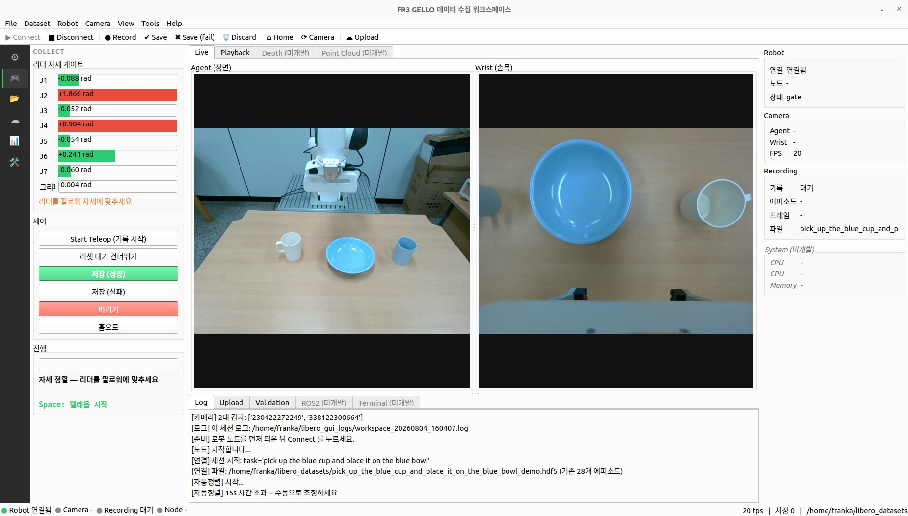
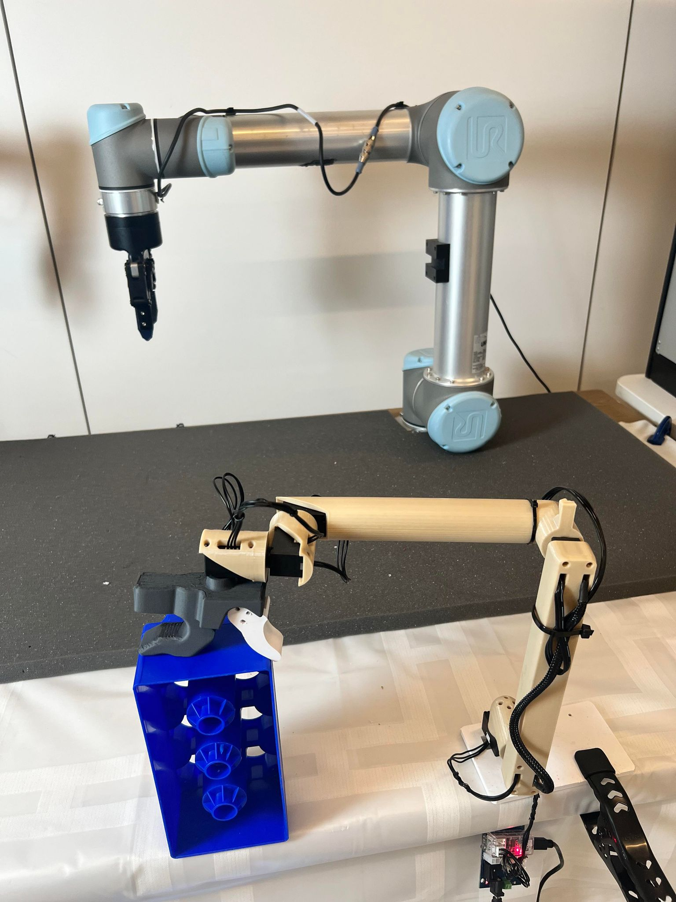

# manipulation-stack

Everything that runs on one robot manipulation station: teleoperation,
scene-based demonstration collection, dataset schema and curation, and
deployment of the trained policy back onto the same arm.

<p align="center">
  
</p>

Built and used daily on a Franka Research 3 with a [GELLO](https://wuphilipp.github.io/gello_site/)
leader arm at Kyungpook National University. It began as a fork of
[gello_software](https://github.com/wuphilipp/gello_software) and outgrew it; see
[NOTICE](NOTICE) for what still descends from upstream.

## Why one repository

Collection and deployment are usually split into two codebases. Here they are
not, because they share the pixel pipeline:
`mstack.data.crop.resize_rgb` is called both by `mstack/data/libero_format.py`
when the training dataset is written and by `apps/fr3_policy_client.py` when an
observation is sent for inference. A version boundary between those two callers
is train/serve skew — the kind that costs accuracy silently. The station config,
crop parameters, reset poses and camera clients are shared for the same reason.

## What is here

| | |
|---|---|
| **Teleoperation** | GELLO leader → FR3 over `pylibfranka` (no ROS 2), with a joint-limit wall, voltage watchdog and pose-match gate on the leader |
| **Collection** | A PyQt6 workspace that drives leader + robot + cameras and writes LIBERO-format HDF5, one scene at a time |
| **Scenes** | A scene format with props, an instruction grammar, placement rules and a diversity recommender — so a dataset is planned rather than accumulated |
| **Datasets** | Schema selection (action space, gripper encoding, observation fields), repacking, curation, quality vocabulary, LeRobot conversion, Hugging Face Hub upload |
| **Deployment** | A policy client that streams observations to a GPU inference server and executes action chunks at 20 Hz — see [docs/policy-client.md](docs/policy-client.md) |

## Layout is the dependency graph

Arrows point down only, and `tests/gui/test_layer_rules.py` enforces it. You
should be able to read what depends on what from the tree, without opening
files.

```
mstack/config/     shared leaf — imports nothing
mstack/core/       abstractions (robot / agent / camera / env) and their stubs
mstack/robots|agents|cameras|hw/
                   concrete hardware. data/, scene/ and gui/ may not import these:
                   a data logger must not know whether the arm is an FR3
mstack/data/       dataset schema and formats
mstack/scene/      scene format, rules, props, grammar, plans, Hub sync
                   (scene may use data, never the reverse)
mstack/collect/    the collection engine — emits Qt signals, is not a widget,
                   and is the one layer allowed to know concrete hardware
mstack/gui/        Qt only.  mstack/comm/ — zmq nodes
apps/              entry points; apps/workspace/features/<feature>/ per feature
scripts/           launch | check | calib | convert | analyze
configs/           stations | scenes | collection
```

## Getting started

This is research software shaped around one physical station. Expect to write
your own station file; expect the FR3-specific parts to be FR3-specific.

**Requirements.** Python 3.10+, a Franka Research 3 reachable over FCI, a GELLO
leader on a FTDI serial port, and RealSense cameras.

This runs in **two interpreters**, because `pylibfranka` and the GUI stack do not
have to share a Python version — and on this machine they do not (3.10 and 3.13):

```bash
git clone https://github.com/redEddie/manipulation-stack
cd manipulation-stack

# GUI, library, tests, conversion
pip install -r requirements.txt

# robot node only — the interpreter that talks to the arm
pip install -r requirements_node.txt
```

`pylibfranka` is deliberately in neither file: it must be **built from source**
with the GIL-release patch in [`patches/README.md`](patches/README.md), into the
robot-node interpreter. The PyPI wheels never release the GIL, so a blocking
gripper call freezes the 1 kHz control thread and the robot aborts with
`communication_constraints_violation` within a second of connecting.

**Describe your station.** `configs/stations/<name>.yaml` holds everything that
varies between physical setups — camera roles and resolutions, crop defaults,
loop rate, node address. Nothing else in the tree should hardcode any of it.
Select one with `GELLO_STATION=<name>`; the default is `knu-eng7`.

Values that identify a particular machine — the robot's FCI address, camera
serials, the policy server — are **not committed**. They go in a local overlay
that git ignores and that is deep-merged over the station file:

```bash
cp configs/stations/local.example.yaml configs/stations/knu-eng7.local.yaml
$EDITOR configs/stations/knu-eng7.local.yaml
```

So a clone gets the full structure and the measured values (the wrist crop
offset, for one, was measured off 247 episode frames) while the serial numbers
stay on the machine they belong to. It also keeps the working tree clean, which
matters here: the desktop icon runs `git pull --ff-only` before launching and
skips it when the tree is dirty.

**Calibrate the leader.** Hold the GELLO in the reference pose and read the
joint offsets, then paste them into `PORT_CONFIG_MAP` in
`mstack/agents/gello_agent.py` (the table is keyed by USB serial, so it belongs
to the device rather than to the station):

```bash
python scripts/calib/gello_get_offset.py
```

<p align="center">
  
  
</p>

Wiring and joint order for the single- and dual-arm builds are in
[`imgs/franka_gello_single_v05_annotated.jpg`](imgs/franka_gello_single_v05_annotated.jpg)
and [`imgs/franka_gello_duo_v05_annotated.jpg`](imgs/franka_gello_duo_v05_annotated.jpg);
the FR3's own known configuration is in
[`imgs/robot_known_configuration.jpg`](imgs/robot_known_configuration.jpg).

**Run the collector.**

```bash
python apps/collect_launcher.py      # wizard, then opens the workspace
python apps/collect_workspace.py     # skip the wizard
```

The robot node runs in its own interpreter, because `pylibfranka` lives in a
separate virtualenv from the GUI:

```bash
python scripts/launch/launch_nodes.py --robot fr3
```

The workspace can start and stop that node for you.

**Run a trained policy.** See [docs/policy-client.md](docs/policy-client.md).

## Verification

No hardware and no display needed — the suite runs offscreen:

```bash
bash tests/gui/run_all.sh python
python -m mstack.scene.instruction_grammar
python -m mstack.scene.scene_rules
```

`scripts/check/` holds the pre-session hardware checks: camera USB link speed
and frame delivery (`check_cameras.py`), FR3 preflight, GELLO joint-limit wall
and torque-protection reset.

## Documentation

- [`docs/architecture.md`](docs/architecture.md) — topology, timing
  (1 kHz / 20 Hz / 30 fps), state machines, data lineage
- [`docs/dataset-schema.md`](docs/dataset-schema.md) — what is stored and why
- [`docs/curation-metrics.md`](docs/curation-metrics.md) — episode quality vocabulary
- [`docs/policy-client.md`](docs/policy-client.md) — inference protocol, safety clamps,
  commanded-action derivation
- [`patches/README.md`](patches/README.md) — the pylibfranka GIL-release patches
- [`CLAUDE.md`](CLAUDE.md) — working notes and invariants for contributors

## A note on language

Comments and guide text are often Korean; identifiers, action labels and status
strings are English. That split is deliberate and documented in
`mstack/gui/i18n.py` — read it before adding user-facing strings. New comments
and documentation are written in English.

## License

MIT, and MIT upstream. See [LICENSE](LICENSE), [NOTICE](NOTICE) for provenance,
and [CONTRIBUTORS.md](CONTRIBUTORS.md).

If GELLO itself is useful to you, cite the original work:

```bibtex
@misc{wu2023gello,
    title={GELLO: A General, Low-Cost, and Intuitive Teleoperation Framework for Robot Manipulators},
    author={Philipp Wu and Yide Shentu and Zhongke Yi and Xingyu Lin and Pieter Abbeel},
    year={2023},
}
```
