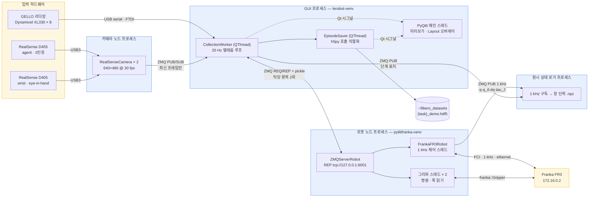
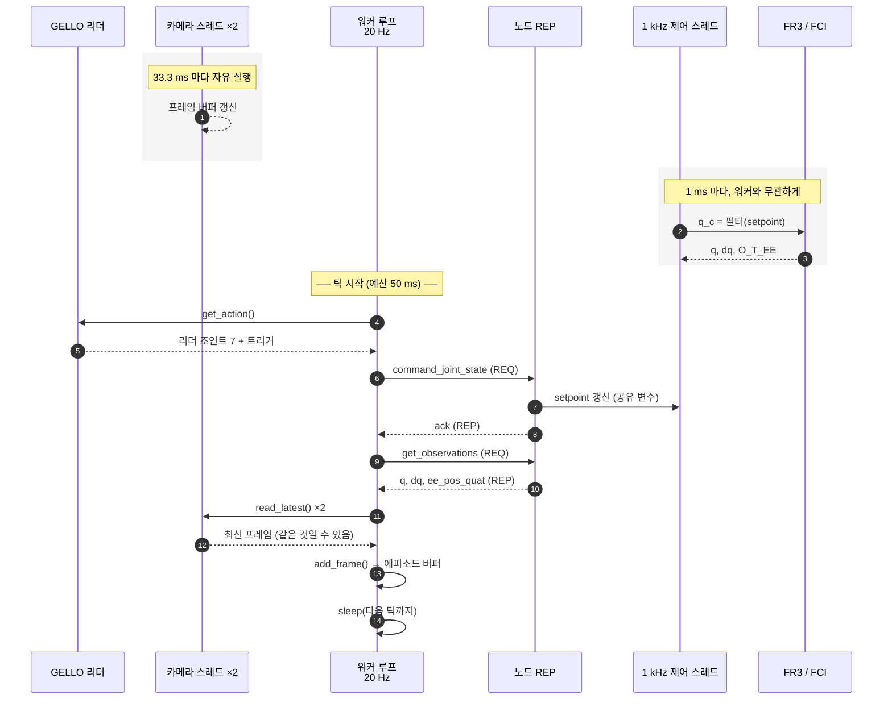
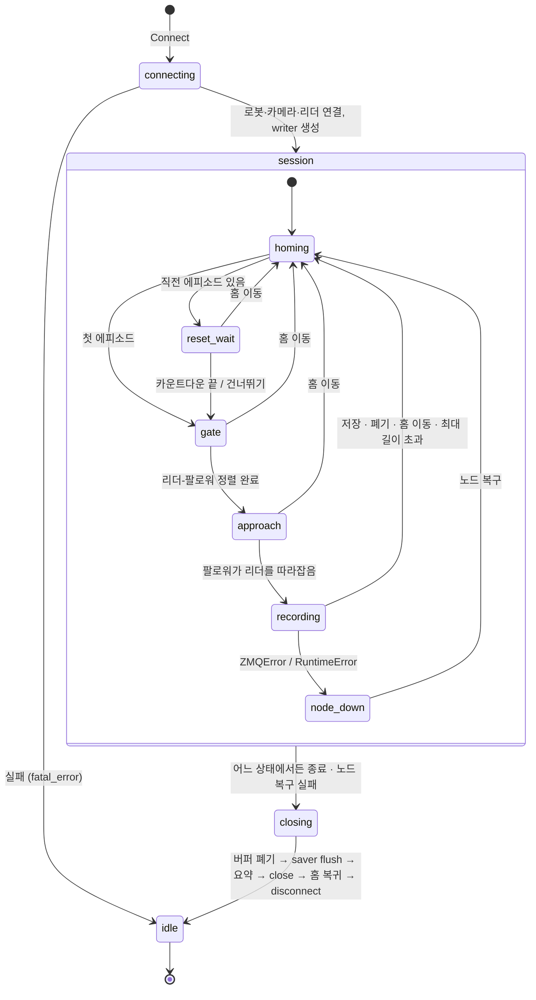
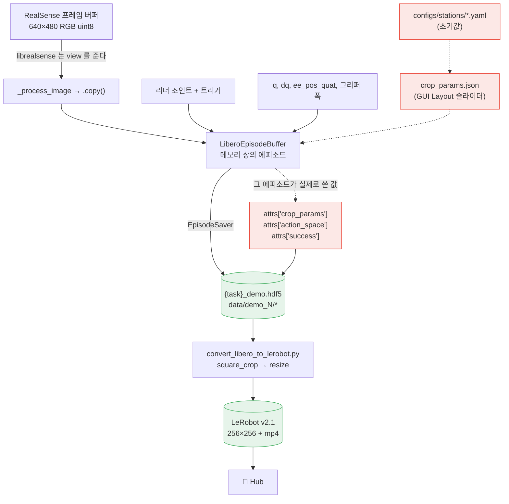

# 아키텍처

FR3 + GELLO 텔레옵 수집 파이프라인의 구조. "통신"과 "데이터 수집"은 서로 다른
축이라 한 장에 넣으면 둘 다 안 보인다. 네 장으로 나눈다.

| 장 | 답하는 질문 |
|---|---|
| [1. 토폴로지](#1-토폴로지) | 어떤 프로세스가 어떤 전송으로 붙어 있나 |
| [2. 타이밍](#2-타이밍) | 1 kHz / 20 Hz / 30 fps 가 어떻게 맞물리나 |
| [3. 상태기계](#3-상태기계) | 수집 세션이 어떤 상태를 오가나 |
| [4. 데이터 계보](#4-데이터-계보) | 원시 프레임이 학습 데이터가 되기까지 |

주소·시리얼·스트림 포맷 같은 스테이션 고유값은 전부
[`configs/stations/`](../configs/stations/)에 있다. 아래 그림에 나오는 구체적인
숫자(포트 6001, 640×480 등)는 `knu-eng7` 스테이션의 값이다.

---

## 1. 토폴로지

### 왜 두 프로세스인가

pylibfranka(FCI 바인딩)와 lerobot 은 서로 다른 venv 에 있고 파이썬 버전도 다르다
(3.10 / 3.13). 한 프로세스에 합칠 수 없다. 합칠 수 있더라도 나누는 편이 낫다 —
GUI 가 죽어도 1 kHz 제어 루프는 자기 종료 절차를 밟을 수 있고, 반대로 리플렉스
abort 로 노드가 죽어도 GUI 는 살아서 그 사실을 화면에 띄울 수 있다.

노드는 `--die-with-parent` 로 뜬다. GUI 가 정상 종료하면 `closeEvent` 가 노드를
정리하지만, 슬롯에서 예외가 터져 프로세스가 즉사하면 노드가 FCI 연결을 쥔 채
남아 다음 실행이 노드를 못 띄운다. 그때는 커널이 대신 정리한다
(`prctl(PR_SET_PDEATHSIG)`).

### 전송별 성질

| 구간 | 전송 | 성질 |
|---|---|---|
| 리더암 → 워커 | FTDI USB serial | 동기 읽기. 서보 8개를 매 틱 폴링 |
| 워커 ↔ 노드 | ZMQ REQ/REP + pickle | **엄격한 락스텝**. 요청 하나가 미해결이면 다음 요청 불가 |
| 노드 ↔ FR3 | FCI (libfranka ActiveControl) | 1 kHz 고정. 한 틱이라도 늦으면 로봇이 abort |
| 카메라 → 워커 | ZMQ PUB/SUB | 논블로킹. 최신 프레임만 쓰므로 재전송할 이유가 없다 |
| 노드 → 원시 로거 | ZMQ PUB/SUB | 1 kHz. 발행 비용 5.9 µs/tick (예산의 0.6%), HWM 초과 시 폐기 |
| 워커 → 원시 로거 | ZMQ PUB/SUB | 단계 표지. 로거가 이것으로 창을 끊는다 |

REQ/REP 의 락스텝이 중요하다. 노드가 한 틱 늦으면 워커가 그대로 블록되고, 예외가
`recv()` 와 `send()` 사이에서 빠져나가면 소켓이 영구히 어긋난다. 그래서
`ZMQServerRobot` 은 `RCVTIMEO` 를 걸고 `zmq.Again` 을 명시적으로 처리한다.

전송이 셋으로 갈리는 기준은 **응답이 필요한가**다. 로봇 명령은 응답이 있어야
다음 틱을 계산할 수 있으니 REQ/REP 다. 카메라 프레임과 진단 신호는 최신값만
쓰면 되니 PUB/SUB 다 -- 놓친 것을 재전송할 이유가 없고, 구독자가 없거나 느려도
발행자가 멈추면 안 된다.

카메라는 2026-08-25 에 별도 노드로 분리됐다 (`mstack/comm/camera_node.py`,
구독은 `mstack/comm/camera_client.py`). 그 전에는 GUI 프로세스 안에서
`RealSenseCamera` 를 직접 열었다.

원시 상태 로거(`mstack/comm/robot_raw_logger.py`)가 **프로세스**인 이유는 파이썬
GIL 이다. 전환 간격이 기본 5 ms 라, 쓰기를 노드 안 스레드로 두면 1 kHz 제어
루프가 그만큼 멈춘다 (실측: 파이썬 작업 스레드를 붙이면 모든 틱이 늦었다,
486/486). 프로세스를 나누면 GIL 이 분리되어 로거가 무엇을 하든 제어 루프에
닿지 않는다.

---

## 2. 타이밍

세 개의 서로 다른 주파수가 맞물린다. 이 시스템에서 가장 고유한 부분이고, 실제로
가장 많이 고생한 지점이다.

### 20 Hz 명령이 1 kHz 제어가 되는 곳

워커는 50 ms 마다 목표 조인트각을 하나 던진다. FCI 는 1 ms 마다 값을 요구한다.
그 사이를 노드의 제어 스레드가 메운다:

- **레퍼런스 필터** — setpoint 를 그대로 따라가지 않고 1.0 rad/s 에서 포화한다.
  워커가 준 계단 입력이 매끄러운 궤적이 된다.
- **가속 클램프** — `franka::kMaxJointJerk`(5000) 아래로 유지한다. 20 Hz 계단을
  필터 없이 넣으면 저크 한계를 넘겨 로봇이 abort 한다.

램프 코드가 측정값이 아니라 **명령값을 적분**하는 이유가 여기 있다. 팔로워는
필터 때문에 항상 명령보다 뒤에 있으므로, 매 틱 측정값에 스텝을 더하면 필터 지연이
누적되어 램프가 하염없이 느려진다(4.4 s 관측). 명령을 적분하면 필터가 포화까지
쓸 수 있다.

### 30 fps 를 20 Hz 로 집어가면

30/20 = 1.5. 매 틱 새 프레임이 오지는 않는다 — 두 틱에 한 번꼴로 직전 프레임이
그대로 다시 온다. 그래서 프레임이 한두 번 반복되는 것은 정상이고, **연속 3틱
이상 동일**할 때만 stall 로 본다. 정지한 카메라 화면과 움직이는 조인트값이 같은
프레임에 저장되는 것이 정확히 정책이 학습하면 안 되는 시간 어긋남이라, 워커가
직접 세어서 에피소드와 함께 보고한다.

`read_latest()` 는 논블로킹이라 카메라가 멈춰도 예외를 던지지 않는다
(`max_age_ms` 기본 500 ms = 20 Hz 에서 10틱). 위쪽 어디도 이걸 알려주지 않는다.

### 그리퍼는 별도 스레드

그리퍼 명령은 `franka::Gripper` 를 통해 나가는데 블로킹 호출이라 1 kHz 루프에서
부를 수 없다(부르면 제어 스레드가 멈추고 로봇이 abort 한다). 명령 스레드와 폭
읽기 스레드가 따로 돈다. 명령 후 실제 폭이 움직이기까지 ~0.3 s 지연이 있고, 그
지연 자체가 정책이 배워야 할 신호다.

---

## 3. 상태기계

`CollectionWorker.run()` 하나에 전부 들어 있다(의도적으로 쪼개지 않았다). 상태는
`state_changed` 시그널로 GUI 에 나간다.

### gate — 왜 대기 상태가 있나

리더와 팔로워의 모든 조인트가 `GATE_RAD`(0.5 rad) 안에 들어올 때까지 기다린다.
자세가 크게 다른 채로 텔레옵을 시작하면 팔로워가 그 차이를 한꺼번에 따라잡으려
들고, 그건 사람이 있는 작업공간에서 일어나면 안 되는 움직임이다. 자동정렬을
쓰면 리더 쪽을 팔로워의 리셋 자세로 끌어온다(사람이 손을 얹고 있는 쪽이
리더이므로, 움직여야 할 것은 이쪽이다).

### node_down — 두 가지 고장이 같은 곳으로 온다

(a) 노드 프로세스가 죽거나 네트워크에서 사라짐 (`zmq.ZMQError`), 또는
(b) 프로세스는 멀쩡히 ZMQ 요청에 답하는데 1 kHz 제어 스레드만 죽음 (리플렉스
abort). 복구 절차가 같아서 한 상태로 합쳤다.

(b)는 예전엔 **아예 안 보였다**. `get_observations()` 가 마지막 위치를 영원히
반환해서 여기서 예외가 나지 않았고, GUI 는 몇 틱 뒤부터 그냥 "멈춘 것처럼"
보이기만 했다. 지금은 `franka_fr3.py` 가 제어 스레드의 사망을 보고하면
`ZMQClientRobot` 을 통해 `RuntimeError` 로 올라온다.

### 에피소드가 끝나는 다섯 가지 방법

| 끝난 이유 | 저장? | 성공 라벨 |
|---|---|---|
| 저장 버튼 (성공/실패) | O | 누른 대로 |
| 폐기 버튼 | X | — |
| 홈 이동 버튼 | X | — |
| 프레임 2개 미만 | X | — |
| `max_episode_seconds` 초과 | O | **실패로 자동 저장** |

마지막 줄이 의도적이다. 조작자가 아무 버튼도 안 누른 채 최대 길이에 닿았다는
것은 성공이 아니라는 뜻이므로, 라벨 없이 두는 대신 실패로 못 박는다.

### 저장이 별도 스레드인 이유

h5py 는 스레드 안전하지 않다. `EpisodeSaver` 가 시작된 뒤로 파일을 만지는 호출
(save/delete/list)은 전부 그 큐를 통과한다. 워커는 버퍼만 다루고
(`add_frame`/`start_episode`/`discard_episode`), 에피소드가 끝나면 버퍼를 떼어
넘긴다. 그래서 **다음 에피소드 녹화가 직전 에피소드 저장과 겹칠 수 있다** —
조작자는 저장을 기다리지 않는다.

---

## 4. 데이터 계보

### 세 가지 함정

**① 드라이버 버퍼는 view 다.** librealsense 는 프레임 버퍼 풀을 재활용하고
`get_data()` 는 그 안을 들여다보는 view 를 준다. lerobot 의 `_postprocess_image`
는 색 변환이나 회전이 걸렸을 때만 복사하는데, 이 수집기는 둘 다 요청하지 않는다.
view 를 그대로 append 하면 200프레임 에피소드가 같은 이미지 몇 장의 반복이 된다 —
shape 도 개수도 맞고 에러도 없이. 그래서 `_process_image` 가 항상 `.copy()` 한다.
`np.ascontiguousarray` 로는 못 고친다(이미 연속이면 no-op).

**② .hdf5 는 원본 보관소다.** 기본 설정에서 크롭도 리사이즈도 하지 않고 640×480
을 그대로 저장한다. 크기를 줄이는 것은 LeRobot 변환에서 한다. 학습 해상도를
바꾸려고 다시 찍을 일이 없도록.

**③ 크롭은 세 겹이다.**

| 어디 | 무엇 | 언제 바뀌나 |
|---|---|---|
| `configs/stations/*.yaml` | 초기값 | 카메라 마운트를 바꿀 때 |
| `~/libero_gui_logs/crop_params.json` | 현재 설정 | Layout 슬라이더를 움직일 때 |
| hdf5 `attrs['crop_params']` | **그 에피소드가 실제로 쓴 값** | 에피소드마다 |

변환기는 세 번째를 읽는다. 그래야 몇 달 전 에피소드도 그때의 프레이밍으로
재현된다. attrs 가 없는 옛 파일은 `EYE_IN_HAND_CROP_X_SHIFT`(=31, 역사적 상수)로
떨어진다 — 그 파일들이 실제로 그 값으로 찍혔기 때문이다.

정책 추론(`fr3_policy_client.py`)도 같은 `crop_params.json` 을 읽는다. 학습
데이터와 추론 입력의 프레이밍이 다르면 정책이 못 맞춘다.

---

## 그림 고치는 법

전부 mermaid 라 텍스트로 diff 가 보인다. GitHub 과 Notion 이 그대로 렌더링한다.
별도 도구 없음.

`frankarobotics/labs` 는 같은 목적에 Structurizr DSL(C4)을 쓴다. 뷰가 열 개
넘어가면 그쪽이 낫지만, 네 장에는 과하다.
